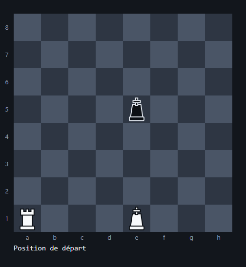
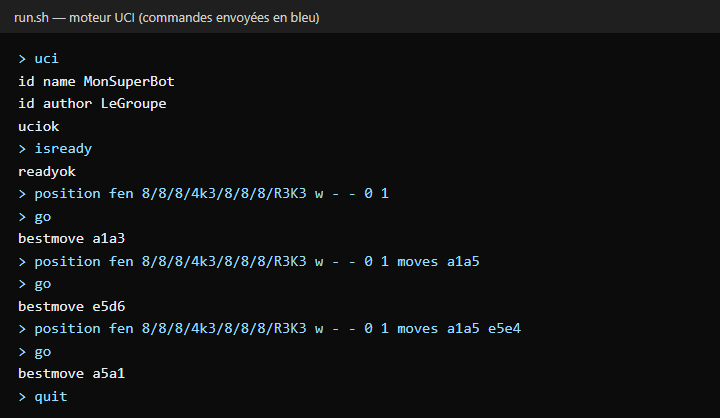

# Projet R3-04 - Moteur d'Échecs (Finale RKK)

Moteur d'échecs qui joue la finale **Roi + Tour (Blancs) contre Roi (Noirs)** et communique avec
n'importe quelle interface d'échecs via le protocole **UCI** (ChessX, CuteChess…). Le développement
respecte les principes **SOLID** et la **Clean Architecture**.

> Projet d'équipe réalisé en BUT Informatique (R3-04). Ce dépôt est une copie du
> [dépôt de l'équipe](https://github.com/AKLOUF/Jeu_d-echec_205-206), complétée après le rendu
> (voir « Corrections après le rendu » plus bas).

## 🎬 Aperçu

Une partie jouée par le moteur (il joue les deux camps) depuis la position Roi + Tour contre Roi :



Dialogue UCI avec le moteur, tel qu'une interface comme ChessX le mène :



> Les coups proviennent réellement du moteur. La stratégie par défaut (`RandomStrategy`) choisit
> un coup légal au hasard, donc une nouvelle exécution donne d'autres coups.

---

## 👥 Membres de l'équipe
**Groupe TP 205-206 :**
- Tanim VEER (206)
- Alexandre GUELY (205)
- Imadeddine AKLOUF (205)
- Ethan MEBALEY KAHEL (205)

---

## 🚀 Installation et Exécution

### Prérequis
- Java 17 ou supérieur (`javac` et `java` dans le PATH).
- Une interface graphique compatible UCI (ex : ChessX, CuteChess).

### Lancer le moteur

```bash
chmod +x run.sh   # une seule fois
./run.sh
```

`run.sh` compile les sources dans `out/` puis lance le moteur, qui attend des commandes UCI sur
l'entrée standard. Exemple de session :

```text
uci
id name MonSuperBot
id author LeGroupe
uciok
position fen 8/8/8/4k3/8/8/8/R3K3 w - - 0 1 moves a1a5
go
bestmove e5e6
```

### Utilisation dans ChessX
1. Ajoutez `run.sh` comme moteur UCI dans les préférences.
2. Configurez une position "Setup" avec Roi Blanc, Tour Blanche et Roi Noir.
3. Lancez "Match against Engine".

---

## 🏗️ Architecture du Projet
Le projet suit la Clean Architecture pour garantir l'indépendance des règles métier. Les dépendances
vont uniquement vers l'intérieur (du plus instable vers le plus stable).

```text
run.sh / test.sh

src/
├── Appli.java                       # Point d'entrée (Main)
└── chess/
    ├── adaptator/                   # Couche Adaptateur
    │   └── UCIEngine.java           # Gestion du protocole UCI
    │
    ├── useCases/                    # Couche Cas d'Utilisation
    │   ├── MoveGenerator.java       # Génération des coups légaux
    │   ├── IBotStrategy.java        # Interface Strategy
    │   ├── BotStrategy.java         # IA déterministe (premier coup légal)
    │   └── RandomStrategy.java      # IA aléatoire
    │
    └── businessLayer/               # Couche Métier (Indépendante)
        ├── IPiece.java
        ├── Move.java
        ├── Color.java
        ├── board/
        │   ├── Board.java
        │   ├── Square.java
        │   └── Position.java
        └── piece/
            ├── Piece.java
            ├── PieceType.java
            ├── King.java
            └── Rook.java

test/
└── chess/useCases/MoveGeneratorTest.java
```


## Description des couches

1. **chess.businessLayer** (Cœur du projet)
   - Contient les entités pures : Board, Square, Position, Move, et les pièces (King, Rook).
   - Dépendance : aucune.

2. **chess.useCases** (Logique de jeu)
   - Contient la génération des coups légaux (MoveGenerator) et les stratégies du robot (BotStrategy, RandomStrategy).
   - Dépendance : utilise businessLayer.

3. **chess.adaptator** (Communication)
   - Gère le protocole UCI (UCIEngine) et le point d'entrée (Appli).
   - Dépendance : utilise useCases et businessLayer.

---

## 📊 État du Projet
- **Génération de coups** : la Tour et le Roi se déplacent correctement (pas de traversée de pièces, captures gérées), et seuls les coups légaux sont proposés (pas d'auto-échec, clouage respecté, obligation de parer un échec).
- **Protocole UCI** : `uci`, `isready`, `position` (FEN ou startpos, avec la liste `moves`), `go`, `quit`.
- **Stratégie** : pattern Strategy permettant de changer d'IA (aléatoire ou déterministe) sans toucher au reste du moteur.

---

## ✅ Tests

```bash
./test.sh
```

11 tests couvrent les déplacements de la Tour et du Roi, les obstacles (pièces amies et ennemies),
l'interdiction de se mettre en échec, le clouage, l'obligation de parer un échec, la lecture du trait
depuis le FEN et la conversion des coups au format UCI.

> Ces tests et les corrections ci-dessous ont été ajoutés après le rendu du projet : les tests
> d'origine n'avaient pas été versionnés dans le dépôt de l'équipe.

### Corrections après le rendu
- Le moteur rejoue désormais la liste `moves` envoyée par l'interface : avant, il repartait toujours
  de la position initiale et ne pouvait pas suivre une partie au-delà du premier coup.
- Le camp qui a le trait est lu depuis le FEN et suivi à chaque coup : les stratégies jouaient
  toujours pour les Blancs.
- `run.sh` compile le projet avant de le lancer (il dépendait d'un dossier de compilation d'IntelliJ
  absent du dépôt) et utilise des fins de ligne Unix.

---

## 📝 Bilan
Ce projet nous a permis de comprendre l'importance du découpage en couches. La principale difficulté
a été la mise en place du protocole UCI et la gestion des entrées/sorties sans interface graphique
Java. L'application stricte des principes SOLID (notamment le pattern Strategy et le principe de
Liskov pour les pièces) rend le code modulaire et facile à faire évoluer pour ajouter d'autres pièces.
